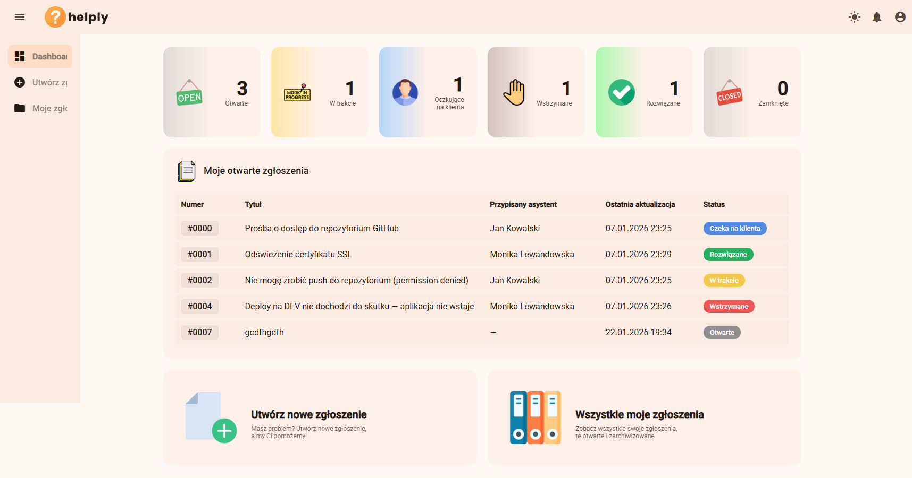
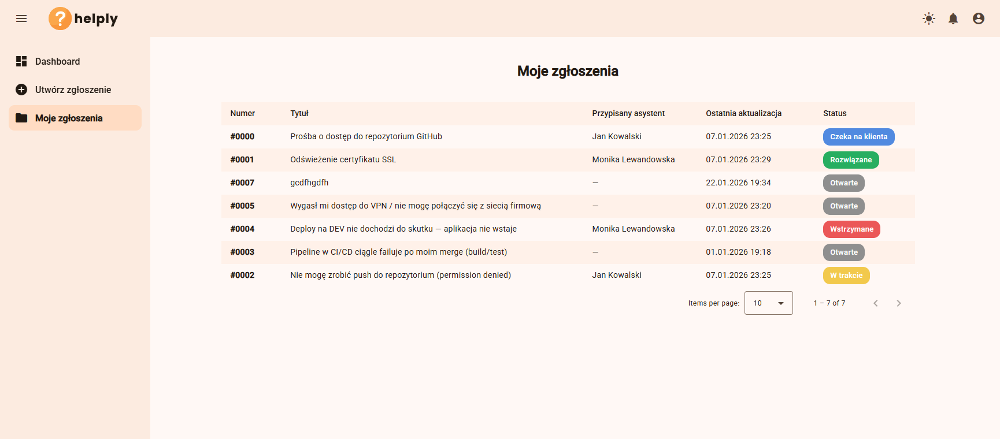
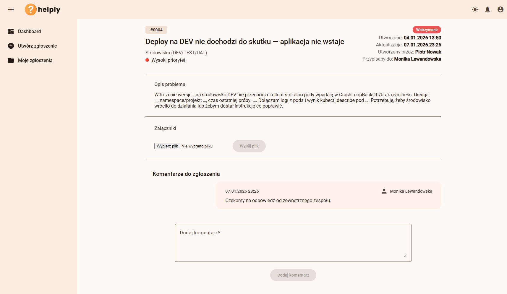
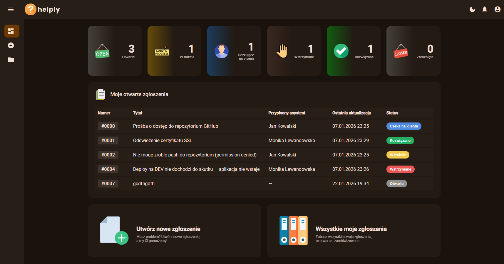
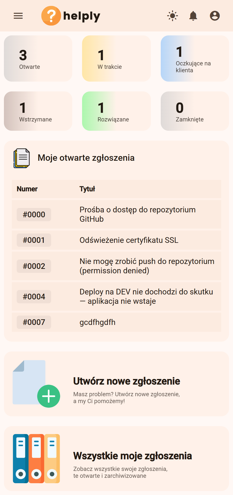
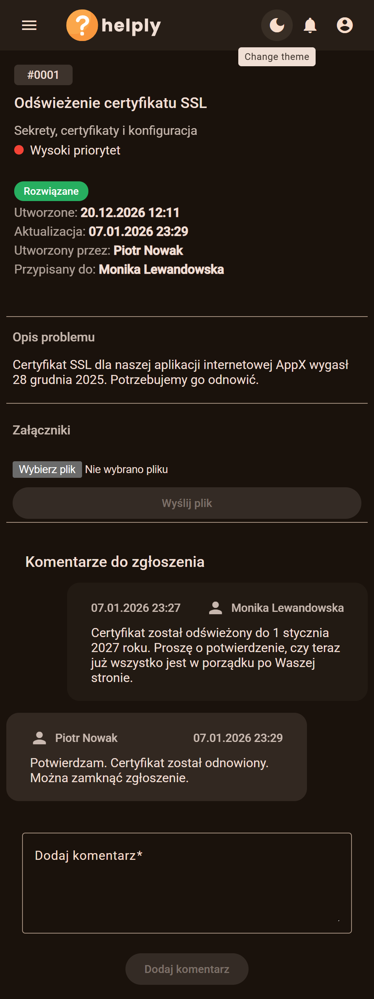
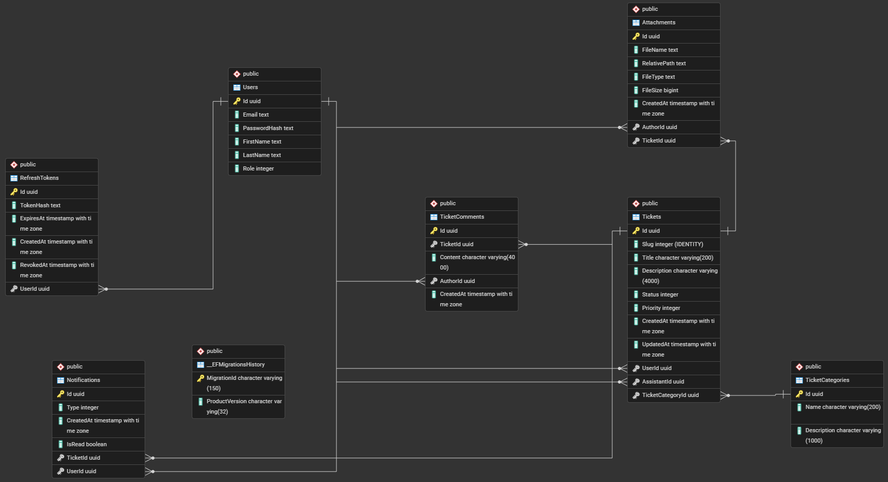

<br><br>

Helply is a lightweight helpdesk/ticketing application.

It consists of:

- Angular SPA (frontend)
- ASP.NET Core Web API (backend)
- Background worker (MassTransit + RabbitMQ consumers)
- PostgreSQL database
- RabbitMQ (message broker)
- Optional dev tooling: pgAdmin + Seq

## Key features

- Email + password authentication (JWT access tokens + refresh tokens)
- Role-based access: `User` and `Assistant`
- Ticket management: create, view, update, assign, change status/priority
- Ticket categories
- Comments on tickets
- File attachments for tickets
- Notifications delivered via SignalR and messaging events

## Running the full stack (Docker Compose)

Prerequisites:

- Docker Desktop (Windows/macOS) or Docker Engine (Linux)

All compose files live in the `docker/` folder, so run commands from there.

### Start core services

This starts the core stack (Postgres, RabbitMQ, backend, worker, frontend):

```bash
cd docker
docker compose up -d --build
```

### Start with the `dev` profile (pgAdmin + Seq)

The `dev` profile enables additional dev-only services:

- `pgadmin` (PostgreSQL UI)
- `seq` (log viewer)

```bash
cd docker
docker compose --profile dev up -d --build
```

### Useful URLs / ports

- Frontend: http://localhost:4200
- Backend API: http://localhost:5202
- RabbitMQ management UI: http://localhost:15672 (user: `rabbitmq`, password: `rabbitmq`)
- PostgreSQL: `localhost:5432` (db: `appdb`, user: `appuser`, password: `apppassword`)

Dev profile only:

- pgAdmin: http://localhost:5050 (email: `admin@admin.com`, password: `admin`)
- Seq: http://localhost:8081

### Stop the stack

```bash
cd docker
docker compose down
```

To also remove the database data volume (fresh DB next time):

```bash
cd docker
docker compose down -v
```

## Database seeding (`db.sql`) using the `seed` profile

The repository includes a seed script at `docker/db.sql`. The compose service `db-seed` runs `psql` inside a Postgres image and imports that file into the running `postgres` service.

Important: the seed file uses `COPY` into existing tables. The backend applies EF Core migrations automatically on startup, so make sure the backend has started at least once before seeding.

### Seed on a fresh database (recommended)

```bash
cd docker

# 1) Reset everything (removes volumes)
docker compose down -v

# 2) Start the core stack so migrations run
docker compose up -d --build

# 3) Import seed data (profile: seed)
docker compose --profile seed run --rm db-seed
```

If you want to see the output and have the command exit with the container status, you can also use:

```bash
cd docker
docker compose --profile seed up --abort-on-container-exit db-seed
```

Note: re-running the seed on a non-empty database may fail due to duplicate primary keys.

## Default accounts

The following users are included in `docker/db.sql`. All accounts use the same password:

- Password: `Password123`

| Email | Name | Role |
|---|---|---|
| piotrnowak@gmail.com | Piotr Nowak | User |
| jankowalski@gmail.com | Jan Kowalski | Assistant |
| monikalewandowska@gmail.com | Monika Lewandowska | Assistant |
| annamaj@gmail.com | Anna Maj | User
| michalzielinski@gmail.com | Michał Zieliński | User

## Screenshots

Click any thumbnail to open the full image.

<p>
	<a href="./screenshots/dashboard.png"></a>
	<a href="./screenshots/tickets.png"></a>
	<a href="./screenshots/ticket.png"></a>
</p>

<p>
	<a href="./screenshots/dashboard_dark.png"></a>
	<a href="./screenshots/dashboard_mobile.png"></a>
	<a href="./screenshots/ticket_dark_mobile.png"></a>
</p>

## ERD Diagram

<a href="./screenshots/erd.png"></a>
